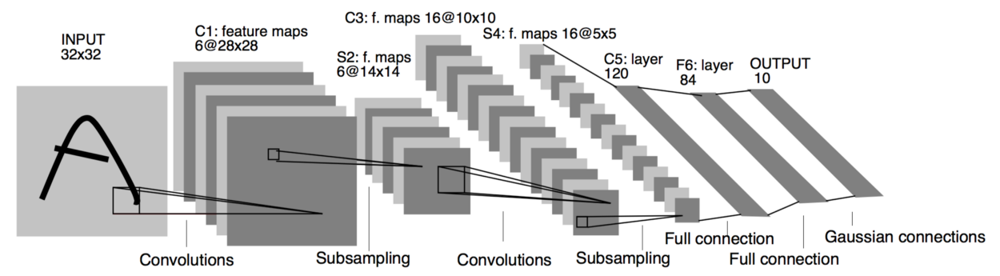
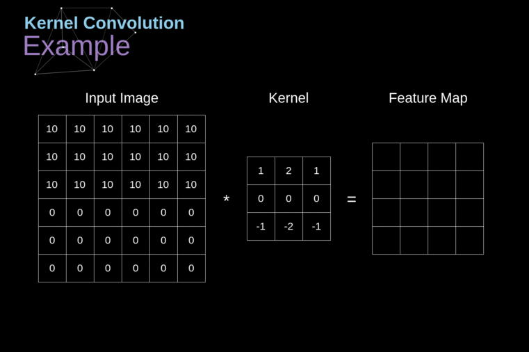
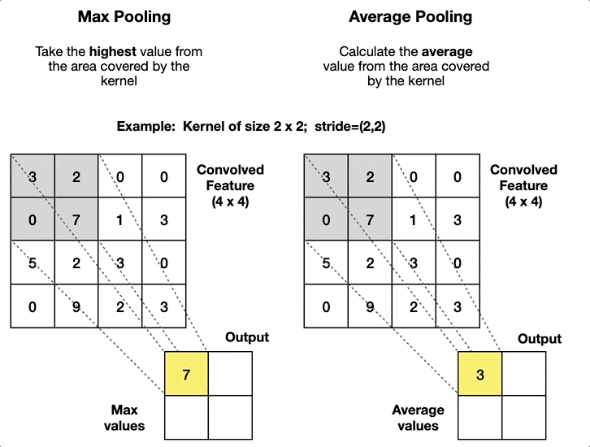

# CNNs: all you need to know

---

## The birth of CNNs

In 1989, Yann LeCun and his colleagues introduced the LeNet-1 architecture in the <a target="_blank" rel="noopener noreferrer" href="https://ieeexplore.ieee.org/document/6795724">Backpropagation Applied to Handwritten Zip Code Recognition</a> paper. But this was just the beginning of what would go on to revolutionize deep learning and computer vision.

Throughout the 1990s, LeCun kept refining this architecture. It was during these years that the term **Convolutional Neural Network** became widely adopted by the community. Then, in 1998, he and his peers revealed LeNet-5 to the public in <a  target="_blank" rel="noopener noreferrer" href="https://ieeexplore.ieee.org/document/726791">Gradient-Based Learning Applied to Do cument Recognition</a>, a paper that remains one of the most influential in the field today.

> Convolutional Neural Networks are often called CNN or ConvNets

Their work on LeNet-5 demonstrated the potential of CNNs for handwritten digit recognition, laying the foundation for modern deep learning applications. Unlike traditional machine learning techniques, which relied on handcrafted feature extraction, **CNNs introduced an automated way to learn spatial hierarchies of features directly from data**. This ability to extract relevant patterns with minimal human intervention made CNNs a game-changer in image recognition and beyond.

Lets take a quick glance at the structure of a CNN in the image below.

Confused? Don't worry, this will all make sense once you reach the end of this post.

---

## What is a Convolution?

At the heart of CNNs lies the convolution operation (hence the name), a mathematical process that allows the network to detect patterns in images. In simple terms, a convolution involves the use of a small (**learnable**) matrix, called a **kernel** or **filter**, across an input image to produce a transformed output, known as a **feature map**. Or, put simply: we slide the kernel across the input image, generating a transformed output.

But how does the kernel produces a new output? It's actually a pretty straightforward process: as the kernel slides across the input image, we compute the **element-wise multiplication followed by a summation** between the kernel and the segment of the image currently "aligned" with it. 

> You can think of each step of the convolution operation as an **inner product** if that helps, but be warned: hardcore mathematicians might talk behind your back!

The **result of each step of the convolution operation is a single numerical value (a scalar)** that represents the level of activation for the applied filter at that specific location.

> The convolution operation helps capture local patterns such as edges, textures, and more complex shapes at deeper layers.

Mathematically, if we represent an image as a matrix $I$ and a kernel as a matrix $K$, the convolution operation at a certain position $(i,j)$ can be defined as:

$$
O(i,j) = \sum_m \sum_n I(i+m, j+n) \cdot K(m,n)
$$

Where:
- $I(i+m, j+n)$ represents a local patch of the image.
- $K(m, n)$ is the convolutional filter.
- $O(i, j)$ is the output at that location.

From this equation, we can clearly see how the kernel slides over the image, multiplying and summing pixel values to emphasize certain features.

Okay, this might be getting confusing, but don't worry, I promise it's a really simple concept. On the image below we can observe the convolution operation essentially does the following:
1. Slides the kernel matrix
2. Computes element-wise multiplication followed by summation
3. Produces one part of the output

> Image source: <a  target="_blank" rel="noopener noreferrer" href="https://medium.com/towards-data-science/gentle-dive-into-math-behind-convolutional-neural-networks-79a07dd44cf9">Piotr Skalski</a>

Simple, right? But did you notice something? **The output image is smaller (Height $\times$ Width) than the input!** Why? Those of you who are really proficient in mathematics might already know the answer just by looking at the equation. But for those who aren't as in love with math (myself included 😝), there's an easier and more intuitive way to understand it.

If you pay attention to either the equation or the GIF above, you'll notice that during each step of the convolution operation, we are essentially producing an output for the center of the kernel. This is precisely why **the kernel size must be an odd value!** 
Therefore, the output size of a convolution operation can be defined as:

$$
H_{\text{out}} = \frac{H_{\text{in}} - K_H + 2P_H}{S_H} + 1
$$

Where:
- $H_{\text{out}}$ is the output's height size.
- $P$ represents the padding.
- $S$ is the stride.
- $K_H$ is the kernel's height size.

Same thing for the width:
$$
W_{\text{out}} = \frac{W_{\text{in}} - K_W + 2P_W}{S_W} + 1
$$

Okay what happened here? Where did all these new terms came from? Don't worry, we'll get into it

---

## Stride and Padding

In our convolution operation, we noticed something odd: the output size is smaller than the input. But what if we want to keep the original dimensions? Or control how much the image shrinks? That’s where padding and stride come in.

### Stride

The stride determines *how far the kernel moves at each step* (applies for vertical steps and horizontal steps). By default, stride is set to 1, meaning the kernel moves or slides one pixel at a time. Increasing the stride makes the filter move faster across the image by taking "big steps", reducing the output size. This is quite intuitive right? Just imagine if after the first step of our convolution operation we take a huge step so that the next one takes place at the other edge of the image, then we'll be performing only 2 "element-wise multiplication followed by a summation" across the image's width, essentially producing a output of width size of 2.

Let's take a look at some stride examples to better grasp is behavior and concept:
- Stride = 1
  - The kernel moves one pixel at a time.
  - Produces detailed feature maps (no pixel or content is skiped).
  - Standard in deep networks.

- Stride = 2
  - The kernel moves two pixels at a time.
  - Reduces the output size by half.
  - Often used in early layers to reduce spatial resolution quickly (Why? the smaller our inputs, the faster our computations)

- Stride > 2
  - The kernel moves even further per step.
  - Can aggressively downsample the image.
  - Not very common, as it may lose fine-grained details.

### Padding

Padding is a technique that adds extra pixels around the borders of an image before applying the convolution operation. The idea is simple: by increasing the size of the input, we compensate for the "shrinkage" caused by the convolution operation. This (combined with some stride value, usually 1) ensures that the output maintains the same spatial dimensions as the input.

> Keep in mind that by default, padding is set to 0 (no padding)

These extra pixels typically have a value of 0 (a method known as **zero-padding**), but there are several alternative padding strategies, each with different effects:

- Replicated Padding: Extends the border pixels by copying the values of the edge pixels outward. This helps prevent sudden (visual) discontinuities at the edges.
- Reflect Padding: Mirrors the image content along the edges, reducing artificial borders and making the transition smoother.
- Constant Padding: Fills the extra pixels with a fixed constant value (not necessarily zero).
- Circular Padding (Wrap Padding): Wraps around the image, using pixels from the opposite side to pad the missing values, making it useful for periodic signals or textures.

Although padding strategies can slightly influence how the network perceives edges and patterns, in practice, the choice of padding does not significantly impact the overall performance of a CNN. This is because padding is typically a very small fraction of the image, and most crucial information is found within the main content rather than the borders and artificially added pixels.

### Common Configurations: What Works Best?

Different architectures use different combinations of padding and stride, depending on the task. Here are some common choices:

| Kernel Size  | Padding | Stride | Use Case |
|--------------|---------|--------|----------|
| 3 $\times$ 3 | 1       | 1      | Standard for most CNN layers |
| 5 $\times$ 5 | 2       | 1      | Used for larger receptive fields |
| 3 $\times$ 3 | 0       | 2      | Aggressive downsampling, often followed by pooling |
| 7 $\times$ 7 | 3       | 2      | Used in first layers of large CNNs like ResNet |

Do you notice how kernel sizes are relatively small? In fact, the 3 $\times$ 3 kernel is the most widely used in modern CNN architectures. This is not just by chance—research has shown that stacking multiple small kernels can achieve the same receptive field as a larger kernel while being more efficient in terms of both computation and parameter count.

For example, instead of using a 5 $\times$ 5 kernel, we can stack two 3 $\times$ 3 kernels sequentially. Both configurations result in a receptive field of 5 $\times$ 5, but the stacked approach introduces non-linearity between the two layers while also reducing the number of parameters! Thus, using smaller kernels reduces computational cost while improving the network’s ability to learn hierarchical representations. This idea was popularized by architectures like VGGNet <a  target="_blank" rel="noopener noreferrer" href="https://arxiv.org/abs/1409.1556">(Simonyan & Zisserman, 2014)</a>, which rely exclusively on 3 $\times$ 3 convolutions to build deep networks efficiently.

> Whoa, a new term just popped up: **receptive field**! Simply put, this refers to the **region of the input that influences a given output**. In other words, it tells us **how much of the original image a neuron actually "sees" and learns from**. The deeper we go in the network, the larger the receptive field becomes, allowing higher layers to capture more abstract and complex patterns.
 
### Bringing It All Together
Padding and stride work together to control the spatial resolution of feature maps throughout a CNN. Choosing the right combination depends on the trade-off between computational cost and information retention:

- More padding $\rightarrow$ Retains more spatial information.
- Higher stride $\rightarrow$ Reduces computational load but can discard details.
- Combination of both $\rightarrow$ Maintains a balance.

In practice, architectures like VGGNet and ResNet rely on small kernels (mostly 3 $\times$ 3) with stride 1 and same padding, ensuring that deeper layers capture fine-grained details.

---

## The third dimension: Channels and number of kernels

So far, we've been treating images as **2D matrices**, which makes sense since that’s how we perceive them in the real world. But for computers, images aren't just two-dimensional; **they have have a third dimension!**  

### The Channel Dimension
If you've ever heard of RGB, you already have some intuition about this. Digital images are made up of three color **channels**: Red, Green, and Blue (RGB). Instead of a single matrix, an image is actually a stack of three matrices, where each one represents intensity values for a specific color.  

> Important note: If we're working with a grayscale image, there’s only one channel, meaning a channel dimension of 1, but it is still treated as a 3D shape.

So, instead of being Height × Width, the full structure of an image is actually:

$$
\text{Channels} \times \text{Height} \times \text{Width}
$$

For an RGB image, this means 3 $\times$ H $\times$ W.

### How Does Convolution Work with Multiple Channels?
Now that we have an additional **channel dimension**, how does the convolution operation handle it? 

Do we apply a 2D kernel separately to each channel? Not quite. In theory we could slide the kernel matrix simultaneously across every channel, producing one output per channel and then just summing up these. But instead, we can do something else to take advantage of the "learning" characteristic of a neural network.

Remember, when working with neural netowrks,  **kernels are learnable matrices**, thus instead of treating each channel independently, CNNs use **kernels that also have depth**, thus each "depth" will learn based on each input channel, increasing our learning power! Here’s how it works:

1. **Kernel Depth Matches Input Depth**
   - If the input image has $N$ channels, the convolutional kernel must also have $N$ channels of depth (in practices, most libraries do this automatically and we only need to specify the kernel height and width).  
  
2. **Convolution Happens Per-Channel**
   - Each channel of the kernel is applied to the corresponding channel of the input using element-wise multiplication and summation.
  - This produces one 2D output per channel. 

3. **Summing Across Channels** 
   - The per-channel outputs are summed element-wise to produce a single scalar value for that spatial position in the feature map.

4. **Sliding the Kernel**
  - Of course, we keep sliding the kernel until we reach the end.

### Expanding to Multiple Kernels
So far, we’ve described how one single kernel processes the input image, resulting always in a 2D output, or more precisly  a 1 $\times$ Height $\times$ Width output. But in deep neural networks we want, and need, to have a large channel dimension in order for our model to learn complex relationships. We achieve this by using multiple kernels!

CNNs typically use multiple kernels in each layer. If we apply N kernels, each with the same depth as the input (as explained earlier), we end up with an output with N different feature maps!

Thus, the **output of a convolutional layer** is not just a single 2D feature map but a **stack of feature maps**:

$$
\mathrm{Output\ Shape} = \mathrm{Number\ of\ Kernels} \times H_{\text{out}} \times W_{\text{out}}
$$

> Key takeaway: **the number of kernels controls the output channel dimension size!**

#### Why Use Multiple Kernels?
Each kernel learns to detect different patterns in the image. For example:
- One kernel might detect horizontal edges.
- Another might pick up vertical edges.
- Others may capture textures, colors, or more complex structures.

By stacking multiple feature maps, CNNs can **extract rich hierarchical information** about an image.

---

## Other Operations Used in CNNs

In a typical CNN, we have two other essential operations besides convolution:

- Activation
- Pooling

These operations play a crucial role in making CNNs efficient, stable, and capable of capturing complex features.

### Activation Functions: Introducing Non-Linearity
A **convolution is a linear operation** (element-wise multiplication followed by summation). If we stack multiple convolutional layers without introducing non-linearity, the entire network would behave like a single linear transformation, severely limiting its ability to learn complex patterns.

To solve this, we apply activation functions immediately after each convolutional layer. These functions modify the feature maps, allowing the network to learn non-linear patterns.

> **Remember:** Multiple linear transformations stacked together are still equivalent to just one linear transformation. That’s why we **need** to introduce non-linearity (e.g., activation functions) between them.

#### ReLU: The Standard Choice
The most commonly used activation function in CNNs is ReLU (Rectified Linear Unit):

$$
f(x) = \max(0, x)
$$

This means:
- Positive values remain unchanged.
- Negative values are set to zero.

ReLU is simple yet highly effective because it:
- Prevents vanishing gradients (unlike Sigmoid/Tanh).  
- Is computationally efficient (requires only a simple comparison).  
- Encourages sparsity (many neurons output zero, reducing unnecessary computations).

However, standard ReLU has a **dead neuron problem**: once an input becomes zero, it remains zero forever. To address this, we have some variants:

- Leaky ReLU: Allows small negative values instead of setting them to 0.
- PReLU (Parametric ReLU): Learns the negative slope instead of using a fixed value.
- ELU (Exponential Linear Unit): Exponentially decays negative values instead of abruptly clipping them.

Despite these variations, **ReLU remains the default activation function in most CNN** architectures due to its simplicity and effectiveness.

### Pooling: Reducing Spatial Dimensions
While convolutional layers reduce spatial resolution (height and width), the reduction is often minimal, just a few pixels per layer (except when using a stride greater than 1). This means that deeper layers can still produce large feature maps. However, we often want to **downsample** these feature maps to:

- Reduce computational cost (fewer pixels $\rightarrow$ fewer computations).
- Extract dominant features while discarding redundant spatial details. For example, imagine zooming into an image of a cat: many contiguous pixels will be very similar or even identical. Keeping all of them is unnecessary; instead, pooling can select the most representative value, allowing the network to retain essential information while reducing computational cost.

This is where **pooling layers** come in. Pooling layers apply a **pooling window** that slides across the input feature map and applies a function to produce a **single scalar value per region**.

> Image source: <a  target="_blank" rel="noopener noreferrer" href="https://pub.towardsai.net/introduction-to-pooling-layers-in-cnn-dafe61eabe34">Rafay Qayyum</a>

#### Max Pooling: The Most Common Type
Max pooling reduces the spatial size by selecting the maximum value from a small region (pooling window) of the feature map. A typical pooling operation uses a $2 \times 2$ window with stride 2, meaning:

- It takes the maximum value from each $(2 \times 2\)$ patch.
- It slides the window by 2 pixels at a time, so every "pixel" is only evaluated once.
- The output size is reduced by half in each dimension.

**Simple, right?** For every $2 \times 2$ non-overlapping patch, we **keep only the maximum value**, helping retain the most important activations while significantly reducing feature map size.

#### Average Pooling: An Alternative
Instead of taking the maximum value, average pooling computes the average of all values in the pooling window.

- Max pooling is more common since it helps detect strong features.
- Average pooling is sometimes used when we want a smoother feature representation.

---

## The Complete CNN Architecture: Putting It All Together
Now that we've covered **convolution, activation functions, and pooling**, let's see how everything fits together in a complete **CNN architecture**.

A typical **Convolutional Neural Network (CNN)** follows this sequence (with slight variations):

$$
\text{Input Image $\rightarrow$ Conv $\rightarrow$ ReLU $\rightarrow$ Pooling $\rightarrow$ Conv $\rightarrow$ ReLU $\rightarrow$ Pooling $\rightarrow$ Fully Connected Layer $\rightarrow$ Output}
$$

Lets look once again at this image:

> **Remember:** in early layers, the convolution captures low-level features (e.g., edges), while in deeper layers, it captures higher-level patterns like shapes or objects.

Now we are able to fully understand this architecture 🚀, which, by the way, is the LeNet-5 model. Here we are trying to identify to which digit the input image belongs (0-9), and thus we have 10 classification classes. (Yes, the input image is of a letter "A", but it is still trying to classify it as a digit!)

Lets break it down:

1. Input Layer (32×32)
   - The input is a grayscale image (1 channel) of size $32 \times 32$.

2. First Convolutional Layer (C1: 6 feature maps of 28×28)
   - Operation: Convolution
   - Kernels: 6 filters of size $5 \times 5$
   - Stride: 1
   - Padding: None
   - Output: $6 \times 28 \times 28$
   - Activation function (ReLU) is applied.

3. First Subsampling (Pooling) Layer (S2: 6 feature maps of 14×14)
   - Operation: Average Pooling
   - Pooling Window: $2 \times 2$ with Stride 2 $\rightarrow$ Halves the size
   - Output: $6 \times 14 \times 14$

4. Second Convolutional Layer (C3: 16 feature maps of 10×10)
   - Operation: Convolution
   - Kernels: 16 filters of size $5 \times 5$
   - Stride: 1
   - Padding: None
   - Output: $16 \times 10 \times 10$
   - Activation function (ReLU) is applied.

5. Second Subsampling (Pooling) Layer (S4: 16 feature maps of 5×5)
   - Operation: Average Pooling
   - Pooling Window: $2 \times 2$ with Stride 2 $\rightarrow$ Halves the size
   - Output: $16 \times 5 \times 5$

6. Fully Connected Layer (C5: 120 neurons)
   - Operation: Fully Connected (Dense Layer)
   - Input Size: $16 \times 5 \times 5 = 400$
   - Neurons: 120
   - Output: A 1D vector of 120 neurons
   - Purpose: Learns high-level abstract representations.

7. Fully Connected Layer (F6: 84 neurons)
   - Operation: Fully Connected (Dense Layer)
   - Neurons: 84
   - Purpose: Acts as an intermediate feature extractor before classification.

8. Output Layer (10 neurons)
   - Operation: Fully Connected (Dense Layer)
   - Output vector size: 10 (one for each digit: 0-9)
   - Activation Function: Softmax (to get propabilities for each class)
   - Purpose: Outputs class probabilities for digit classification.

---

## Wrapping Up

✅ CNNs are (mainly) composed of convolution, activation, and pooling layers.

✅ Activation functions (eg. ReLU) make CNNs non-linear and powerful.

✅ Pooling layers help downsample feature maps efficiently. 

✅ Fully connected layers process learned features for classification.

By combining these elements, CNNs efficiently learn hierarchical representations of images, making them the foundation of modern computer vision tasks. 🚀  

---

> Congratulations 🎉, you've just mastered a technology that dates back to the previous century! 😅 But hey, that doesn’t mean CNNs are outdated. In fact, they dominated the field until transformers took the spotlight in 2017. Plus, the concept of convolution is still relevant today, even playing a role in Vision Transformers (ViTs). And if you think old stuff isn't any good, just remember backpropagation itself has roots in ideas developed by Newton!

— *Lucas Martinez*  

---