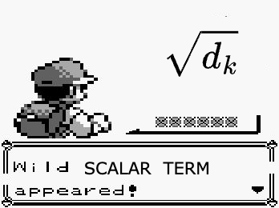
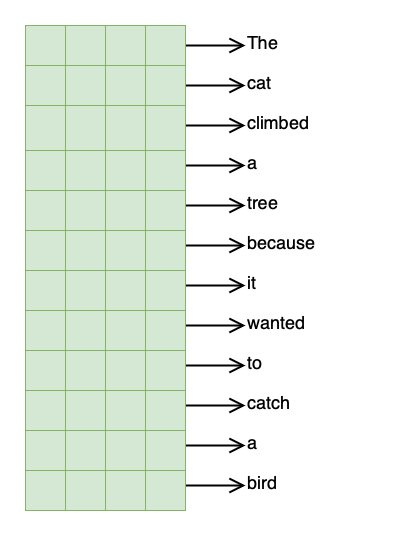
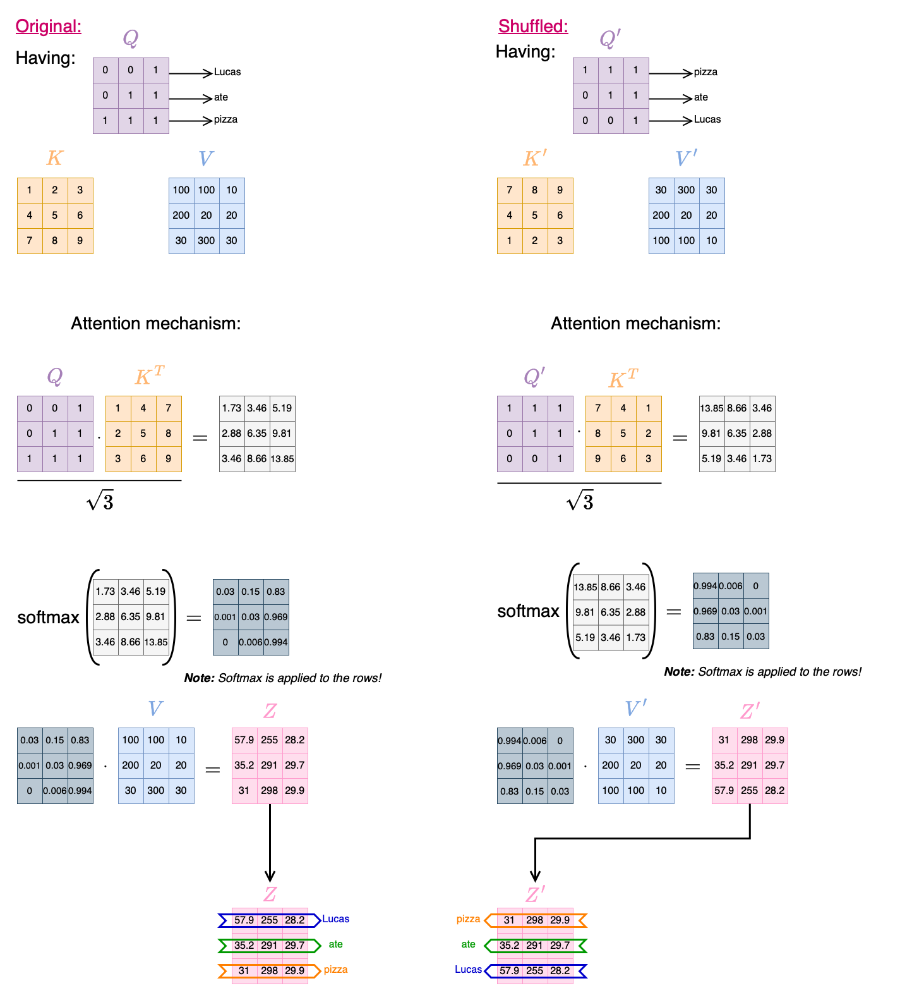

In this post, we'll explore the attention mechanism — what it is, why it was introduced, and how it works behind the scenes. We'll start from the original motivation for attention in sequence models, build up the intuition using real-world analogies, and walk through the math step by step. By the end, you'll understand how attention lets models focus on the most relevant parts of an input, why it needs positional information, and how this idea sets the foundation for powerful architectures like Transformers.

## Why do we need attention?

> It's simpler than it sounds, just pay *attention* 😉

In the world of deep learning, especially in natural language processing, **attention** is a foundational idea that's reshaped how models handle language. You've probably heard of **Transformers** — well, **attention** is what makes them work so well. But attention as a concept actually predates Transformers and comes from a really simple idea: **helping models focus on the most relevant parts of an input.**

Let's rewind for a second to see where this all came from.  

Back in 2014, [Bahdanau et al.](https://arxiv.org/abs/1409.0473) introduced the idea of attention in the context of **machine translation** (what is machine translation? Think Google Translate — actually, Google Translate from a few years ago). 

> Since then, the concept of attention has evolved, giving rise to several variations. Today, the most widely used include **scaled dot-product attention**, **multi-head attention**, and **self-attention** — especially in modern architectures like Transformers.

Before that, models like vanilla RNNs or basic sequence-to-sequence architectures (seq2seq) tried to cram an **entire input sequence** — say, a full sentence or even a paragraph — **into a single fixed-size vector**. This fixed-size vector was supposed to carry all the necessary context to generate the correct translation (output).

That was pretty much the norm at the time. So **what's the issue?** That kind of compression works *okay* for short sequences. But **as inputs get longer or more complex, important details inevitably get lost** in translation (pun intended 😆).

> Imagine you're working as a translator for an important and *really long* speech. But instead of translating it directly, you're only allowed to make a short summary — no more than a specific number of words, regardless of how long the speech is — and then translate *that*.
>
> You can already see the problem, right? A *lot* of context, details, and clarity will be lost. That's essentially what early models were doing.

**Attention** was proposed as a fix. Instead of relying on a single, fixed-size compressed summary, why not let the model *dynamically* decide which parts of the input to focus on at each output step? In other words, let the model decide *where* it should pay attention.

<!-- TODO: probably remove or mention that that is exclusive for transformers -->
<!-- And one more thing, the attention mechanism **does not require a fixed output size.** Instead, the output size of attention is typically determined by the input size. So while attention doesn't compress everything into a single vector, the output size is still "fixed" per token, but **it scales with the input length.** That's part of what makes it so flexible.

> So how did they pull that off? How can the final layer of a model not require a fixed-length input? Don't worry — we'll get into it. -->

Damn, that was a long introduction 😅

---

## Attention: how does it work?

**HOLD UP** — you just read the title above, right? And you *instantly* knew that the word *"it"* in *"how does **it** work?"* was referring to "*Attention*". Pretty obvious to us humans.

Well, the attention mechanism gives machines a similar *superpower* — the ability to figure out what parts of the input are relevant in a given context. Cool, right?

Attention mechanisms are especially useful for **resolving contextual relationships** like pronouns ("it", "this", "they"), coreferences, and dependencies. This is a huge reason why attention-based models (like Transformers) perform so well on tasks like translation, summarization, and question answering.

### Query, Key, and Value: the math behind the attention

At its core, attention is about **comparison**.

The idea is that **for every word** (or token) in a sentence, the model wants to figure out **which other words it should pay attention to** — and how strongly — in order to understand the context correctly. To do this, we turn each word into three different vectors:

- **Query (Q):** what we're looking for.
- **Key (K):** what each word offers.
- **Value (V):** the actual content we want to retrieve.

For **intuition** purposes, think of it as a **search engine**:

- You type a *request or question* into Google — that's your **query**.
- Google returns a list of webpages, usually represented by their *titles or links* — those are the **keys**.
- You click on the title that matches your query the most, and get the *actual content* — that's the **value** for that key.

> Or if you're old-school, think of a library 📚. The **query** is what you're trying to find (say you are working on a homework assignment), the **keys** are the titles of the books, and the **values** are the actual content inside the books. You scan the titles (keys), see which ones match your query, and then dive into the content (value) of the best matched title (key). Easy 🚀.

In attention, we compute how similar a query is to every key. How would you do a comparison given two vectors? That's right, dot product! Then, we turn those similarity scores into weights using a softmax function.

Why softmax? Simple: it normalizes the similarity values into a 0-to-1 range and ensures they sum up to 1, like probabilities! These weights represent how strongly each key corresponds to the query. Finally, we use those weights to compute a weighted sum of the value vectors — yep, another dot product.

Boom 💥, now each word has a **context-aware representation** based on the rest of the sentence.

### The equation

Here's the math version of what we just described:

$$
\text{Attention}(Q, K, V) = \text{softmax} \left( \frac{QK^\top}{\sqrt{d_k}} \right) V
$$

**WATCH OUT! A wild Pokémon appeared!**  

Okay, not a Pokémon — but a new term (close enough): $\sqrt{d_k}$

This is the **scaling factor** and was introduced in the original Transformer paper years later: [Vaswani et al., 2017](https://arxiv.org/abs/1706.03762).

> Why? When we take the dot product between vectors with many dimensions (aka. long vectors), the resulting values can get pretty large — because the dot product is essentially the sum of all element-wise multiplications between the two vectors. The longer the vectors, the larger the expected magnitude of the dot product.  
> 
> If the resulting values are too big, the softmax function becomes too "peaky", strongly concentrated around a few specific positions — or even ends up producing something close to a one-hot vector. That means **one position dominates**, and the others are basically ignored.

Dividing by $\sqrt{d_k}$, where $d_k$ is the dimensionality (size) of the Key vectors, helps **stabilize the gradients** and keeps the softmax in a healthy numerical range.

> Asking yourself why does that work? Damn, you're really into math! Alright then, here's the deeper reasoning. Suppose $q$ and $k$ are two random vectors with $d_k$ dimensions. Their dot product is:
>
> $$
> q \cdot k = \sum_{i=1}^{d_k} q_i \cdot k_i
> $$
>
> If $q_i$ and $k_i$ are zero-mean with variance 1 (a common assumption during initialization), then the **expected variance** of the dot product grows **linearly with $d_k$**. That is:
>
> $$
> \text{Var}(q \cdot k) = d_k \quad \text{and} \quad \text{Std\_deviation} = \sqrt{d_k }
> $$
>
> So, to keep the variance of the scores roughly independent of the vector size, we scale the dot product by $\frac{1}{\sqrt{d_k}}$. This prevents the softmax from blowing up and helps the model train more reliably.

This trick may look small, but it's **crucial for making attention stable and effective**— especially when stacking multiple layers like in Transformers.

So in summary:

- $QK^\top$: measures similarity between Queries and Keys.
- $\frac{1}{\sqrt{d_k}}$: scales the scores to avoid overly large dot products.
- $\text{softmax}()$: turns scores into probabilities (attention weights).
- $\cdot V$: uses the weights to blend the Value vectors.

Yeah, that's the "scary-looking" formula you've probably seen everywhere — but it's really just matching, weighting, and blending. Not bad, right?

> **Note:** In many papers and blog posts, you'll see people refer to  
> $\text{softmax} \left( \frac{QK^\top}{\sqrt{d_k}} \right)$  
> as the **attention matrix** $A$. So, you might also see it written like:  
>
> $$
> \text{Attention}(Q, K, V) = A \cdot V
> $$

### The shapes of Q, K, and V

In practice, $Q$, $K$, and $V$ are all **matrices**, where each **row corresponds to a token** (think of a token as a word, for intuition purposes) in the input sequence, and each row is a vector representing that token.

Then, a full sequence of $n$ tokens becomes a matrix with shape:

- $Q \in \mathbb{R}^{n \times d_k}$

- $K \in \mathbb{R}^{n \times d_k}$

- $V \in \mathbb{R}^{n \times d_v}$

Confused? Let's look at a more intuitive example.

<!-- If we have a sentence with 5 tokens and we embed each token into a 16-dimensional space, then $Q$ has shape $(5, 16)$. -->

Let’s say we have the following sentence(s) as input:

**"The cat climbed a tree because it wanted to catch a bird"**

This sentence has 12 tokens (assuming simple whitespace tokenization)

> What does whitespace tokenization mean? It means we're treating each word as a token, without any extra preprocessing — like removing stopwords, stemming, or using subwords — (which we’ll ignore for now to keep it simple).

We first define (when building our model) the **embedding dimension** for our tokens ($d_k$ and $d_v$). Let's say:

- $d_k = 4$

- $d_v = 4$

> **Must we always set the embedding dimensions as $d_k = d_v$?** In practice, most Transformer implementations set $d_k = d_v$ (especially for multi-head attention, we will talk about this in the following blog post), just to keep things simple and symmetrical. **But it's not a requirement** — and sometimes it can be beneficial to make them different:
>
> For example, smaller $d_k$ can reduce compute during scoring (dot product), while larger $d_v$ can give richer representations in output.

So we will have:

- $n=12$ tokens (i.e., words)

- $d_k=4$ dimensions for Q and K

- $d_v=4$ dimensions for V

This gives us the following matrix shapes:

- $Q \in \mathbb{R}^{12 \times 4}$

- $K \in \mathbb{R}^{12 \times 4}$

- $V \in \mathbb{R}^{12 \times 4}$

Each row in these matrices corresponds to a token. For example, the matrix below could represent the Query matrix $Q$, where each token in the sentence maps to one row (a 4-dimensional embedding vector).

---

## But Wait... Where's the Order?

By design, attention mechanisms don't care about the order of inputs (e.g., words from a sentence) — they treat everything as a set. That's powerful for flexibility, but it comes with a catch: **no sense of sequence** or positions.

**Why is that?**

Well, if you recall from the previous section, attention relies on operations like **dot products** and **matrix multiplication**, which don't account for position — they only compare the content of vectors. When we compute attention, we're comparing a query vector with key vectors based on their values, not their positions in a sentence. The math just doesn't “know” that one word came before another.

That means if you shuffle the tokens in the input (and adjust Q, K, V accordingly), the attention score for each token stays the same. It does not care about the order or position of the tokens (words).

Let's look at an example to understand this better.

> **Remember:** each row corresponds to a token (or word), so shuffling the words in a sentence is equivalent to permuting the rows of the matrices!

Same score for each word, regardless from their position in the sentence! ⚠️

And well, **in natural language, order matters a lot**. Compare:

- *“Lucas ate a pizza in New York”*
- *“a pizza ate Lucas in New York”*

Same words, **totally different meaning.**

> Yes, I'm Lucas, and no, I wasn't eaten by a pizza! At least for now...🍕

Without positional information, attention would treat both sentences as identical — because it only sees a group of vectors, not the order they appeared in. That's why, when working with sequences like text, **we need to explicitly inject positional information**.This allows the model to capture context based not just on content, but on where each word appears in the sequence.

We'll dive deeper into how this is done — through techniques like **sinusoidal positional encodings** or **learned embeddings** — in an upcoming blog post dedicated to positional encodings. You can also read the (upcoming) blog post about Transformers.

---

## Wrapping up

So far, we've explored what the attention mechanism is, why it was introduced, and how it works under the hood — from the high-level intuition of *“just pay attention”* to the full math equation that makes it possible. We also looked at how attention compares each token in a sequence using content-based similarity, and we saw why **that alone isn't enough** to model sequences properly.

Without positional information, attention treats input tokens like an unordered set — which is great for flexibility, but **terrible for understanding things like word order, grammar, or cause and effect** in natural language.

That's where **positional encoding** comes in — it's the missing piece that lets attention-based models understand the structure of language. We'll explore that next.

But this is just the beginning of what attention can do.

In the next blog post, we'll focus entirely on:
- **Self-attention**: how each token attends to every other token (including itself),
- **Multi-head attention**: why using multiple attention heads in parallel makes things even more powerful,
- And how both of these ideas form the foundation of **Transformer** models.

Stay tuned for Part 2: **Self-Attention and Multi-Head Attention Explained**.

---

> If you've made it this far — seriously, props 🎉 . You now understand more about attention than 90% of people who say “oh yeah, Transformers? I use BERT.” 😉

— *Lucas Martinez*  

---