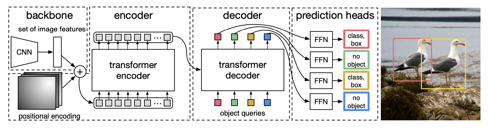

## Why DETR?

Traditional object detection models like Faster R-CNN, YOLO, and SSD have undeniably pushed the field forward, delivering high accuracy and fast inference. But under the hood, they rely on a patchwork of heuristics and specialized components to fix the *noisy-ish* output:

- Anchors: predefined bounding boxes of various shapes and sizes

- Region Proposal Networks (RPNs): used to guess where objects might be located

- Non-Maximum Suppression (NMS): technique used to remove overlapping predictions boxes

<!-- - Custom loss functions and hand-tuned pipelines -->

**Each of these components works... but** they also make object detection pipelines complex, fragile, requiring manual intervention and therefore **hard to generalize.**

So… **what if we could throw all of that out?**

What if we treated **object detection as a direct prediction problem,** like image classification — but instead of predicting a single label, **we predict a set of objects,** each with its class and bounding box?

That's the core idea behind DETR (short for **DE**tection **TR**ansformer), presented by [Carion et al., 2020](https://arxiv.org/abs/2005.12872). It reframes object detection as a set prediction task and uses a Transformer encoder-decoder architecture to learn how to do it end-to-end, without any of the traditional detection-specific hacks.

No anchors.

No proposals.

No NMS.

Just a clean, elegant model that learns to detect objects in a single forward pass 🤯.

---

## Key Idea Behind DETR: Detection as Set Prediction

Most object detectors take an image, divide it up into a bunch of boxes (called **anchors**), and then try to figure out which ones actually contain an object. The result? Hundreds of overlapping guesses, most of which need to be cleaned up later with tricks like non-maximum suppression (NMS).

DETR skips all that hassle:

Instead of "drawing-a-million-boxes-and-hope-for-the-best", DETR tries to predict a set of objects from the image. Simple as that.

It predicts a predefined fixed-size set of object candidates — say, 100 guesses (which is usually more than enough for most images) — and lets the model figure out which ones actually matter (i.e., not background). Some slots will land on real objects, and the rest? Labeled as "no object" and thus ignored. Clean, efficient, and **no post-processing needed.**

### Why Transformers?

Transformers are kind of a perfect match for this setup:

- They don't care about order, just like a set.

- They can model long-range dependencies across the whole image (think: "this banana is near that bowl").

- They can handle multiple object queries at once, each asking: “Is there an object I should care about here?”

So DETR uses a Transformer encoder-decoder, feeding it:

- The image features (from a CNN backbone)

- A bunch of learned object queries

And out comes a neat set of predictions, one per query.

> Sounds confusing? Don't worry, we'll get back to its architecture later!

### Toss the Anchors, Ditch the NMS

Since each query is trained to predict at most one object, and DETR uses a smart matching strategy (we'll talk about the Hungarian algorithm in a sec), there's no need to sort through overlapping boxes or remove duplicates.

That means:

- No anchors ✅

- No region proposals ✅

- No non-maximum suppression ✅

Just end-to-end learning 🧠, as Deep Learning should be!

---

## Architecture Overview

Let's peek under the hood and see what makes DETR tick. **Spoiler:** it's surprisingly elegant and clever.

In short:

1. We extract features from an image using a Convolutional Neural Network (CNN), aka. the backbone

> We also add the positional encodings — a key ingredient for Transformers, since they don't inherently understand spatial structure.

2. We pass them into a transformer decoder-encoder to find the objects.

3. Use FeedForward Networks to classify the objects (i.e. labels) and shape the bounding box.

4. Compute loss (box + class label) against our predictions — and then backpropagate!

### The Backbone (a.k.a. the Feature Extractor)

Like many vision models, DETR starts with a CNN backbone, typically a ResNet-50 or ResNet-101. This part isn't unique to DETR — it's the now-standard, efficient way to turn raw pixel data into something more meaningful: **a feature map.**

So what does it actually do?

It takes the input image and passes it through a stack of convolutional layers. The result? A feature map — essentially a compressed summary of the image's content. In other words, we go from millions of raw pixels to a dense grid where every cell knows roughly what's in its region. And thanks to the depth of the CNN, each cell captures semantic meaning — like "this spot looks like part of a car."

But here's the twist:

DETR then flattens this feature map and runs a linear projection to turn each vector into a 256-dimensional embedding — perfect for feeding into a Transformer.

> **Why flatten it?** Great question.
>
> The CNN outputs a 2D feature map (e.g., shape: 2048 $\times$ 16 $\times$ 16), but Transformers don't process 2D grids. They expect a sequence of tokens.
> So we (DETR) flatten the 16 $\times$ 16 spatial grid into 256 tokens, each of 2048 dims, and then project them into 256-d embeddings. Now it fits what the Transformer expects!

**So the backbone's job?**

Clean up the raw image and translate it into a structured, sequence-friendly format that the Transformer can actually understand.

### Transformer Encoder-Decoder

This is where things get spicy 🥵🔥.

Just like in NLP, DETR uses a **Transformer encoder-decoder architecture:**

- The **encoder** takes the image feature sequence (from the CNN backbone), runs it through layers of self-attention, and builds a globally-aware representation of the entire scene. Thanks to self-attention, every patch can “talk” to every other patch — which is super helpful when trying to figure out if that weird shape is a shadow or an object (spoiler: it depends on what's around it!).

- The **decoder** is where the real action happens. It starts with a fixed set of learned object queries (vectors) — one for each detection slot (e.g., 100 total). These queries don't correspond to any specific location or region in the image; they're just learned vectors. During training, they learn how to attend to the right parts of the image features. Over time, some specialize — one might become great at detecting cars, another at spotting people, and so on.
> 👇 More technically:
> - Each object query is a learned vector (e.g., 256-dim), initialized randomly.
> - They are learned during training — just like weights in a neural network.
> - You usually have a fixed number of them (e.g., 100 queries $\rightarrow$ 100 detection slots).
> - They are fed into the Transformer decoder, and each one:
>   - Uses cross-attention to focus on parts of the image features (from the encoder)
>   - Outputs a embedding that summarizes the image contents (focusing on objects detected)

### The FeedForward Networks

As mentioned, at the end of the encoder-decoder process, each object query produces a 256-dimensional vector — a refined embedding that summarizes what it “found” in the image.

But **that vector alone doesn't give us a class or a box just yet.**

Here's the final step:

Each decoder output is passed through two small independent FeedForward Networks (FFNs):

- One FFN predicts the class label ("car", "person", etc)

- The other FFN predicts the bounding box coordinates (as 4 numbers: center-x, center-y, width, height)

> This are sometimes called classification head and box regression head.

Wait, **what if there's no object?** What label does it predict then? Great question — and if you're wondering that, you're totally following along 👏

Here's another little magic trick 🪄 that DETR pulls off: It introduces a special **“no object” class**, just for those cases where a learned object query doesn't match anything in the image.

---

## The Hungarian Algorithm: Pure Magic

We've seen so far that DETR always makes a fixed number of predictions (say, 100), but most images only have a handful of actual objects. So… how does the model know which predictions to care about during training?

Enter: the Hungarian algorithm.

### The Matching Problem

During training, **DETR outputs a set of 100 predictions per image**. But let's say the **ground truth only has 7 objects.** How do we match the 7 true objects to the 100 predicted ones?

We need a way to:

- Find the best possible one-to-one assignment between predictions and ground truth objects

- Ensure each ground truth object is matched with exactly one prediction

This is where the Hungarian algorithm comes in: a classic optimization method for solving assignment problems.

## How It Works (a light summary)

For each image during training:

1. DETR produces 100 predictions — each one is a (class, bounding box) pair.

2. If the ground truth has fewer than 100 objects, we extend it by adding “no object” labels until we have 100 total targets — one for each prediction slot.

3. We compute a cost matrix between all 100 predictions and the 100 targets (real objects + “no object” fillers). The cost is based on:

    - Classification error — is the predicted class correct?

    - Bounding box error — how close is the predicted box to the ground-truth box?

4. The Hungarian algorithm finds the lowest total cost assignment — i.e., the best one-to-one match between predicted and actual objects.

> **Note:** The matching is not trained end-to-end, but it uses a cost function (classification + box distance) to assign ground truth to predictions before the actual loss is computed and backpropagated.

This algorithm is **simply brilliant**✨:

- It enforces a one-to-one match between predictions and ground truth — **avoiding duplicates and overlapping boxes.**

- It finds the optimal assignment — the one that minimizes the total cost.

This clever matching strategy allows the model to learn which query should predict which object — without any hard-coded heuristics or rule-based assignments.

Genius right? 🤯

---

## The Final Loss Function

Now that we've got the predictions matched to the ground truth using the Hungarian algorithm, it's time to calculate the **loss** — i.e., how wrong the model was, and how it should adjust.

DETR uses a **simple yet effective** two-part loss:

1. A classification Loss

2. A Bounding Box Loss

And combines them into a single function.

---

### 1. Classification Loss

For each matched pair (prediction, ground truth), we compute a **cross-entropy loss** between the predicted class and the actual class.

And yep — this includes the special **“no object”** class, which helps the model learn when *not* to detect anything.

$$
\mathcal{L}_{\text{class}} = - \sum_{c=1}^{C+1} y_c \log(\hat{p}_c)
$$

Where:
- $ C $ = number of object classes  
- $ C+1 $ = the extra “no object” class  
- $ y_c $ is the one-hot encoded true label  
- $ \hat{p}_c $ is the predicted probability for class $ c $

### 2. Bounding Box Loss

For the predicted bounding boxes, DETR uses a combination of two losses:

- **L1 loss** (which is essentially a "distance-based" loss): Measures how far off the predicted box coordinates (center) are from the true ones.

> $$
> \mathcal{L}_{\text{L1}} = \sum_{i} \left| b_i - \hat{b}_i \right|
> $$
>
> Where:
> - $ b = (x, y, w, h) $ is the ground-truth box  
> - $ \hat{b} $ is the predicted box

- **Generalized IoU (GIoU) loss**: Encourages better overlap between the predicted and true boxes, even when they don't intersect (aka. helps adjusting the box size).

> This combo ensures the boxes are both **precisely located** and **well-aligned** with the actual object shapes:
> $$
> \mathcal{L}_{\text{box}} = \lambda_{\text{L1}} \cdot \mathcal{L}_{\text{L1}} + \lambda_{\text{GIoU}} \cdot \mathcal{L}_{\text{GIoU}}
> $$

### Final Loss Function

The final loss is a **weighted sum** of these components:

$$
\mathcal{L} = \lambda_{\text{cls}} \cdot \mathcal{L}_{\text{class}} + \lambda_{\text{L1}} \cdot \mathcal{L}_{\text{L1}} + \lambda_{\text{GIoU}} \cdot \mathcal{L}_{\text{GIoU}}
$$

**Where the $ \lambda $'s are hyperparameters** that control how much each part of the loss contributes.

### Why this works 🤝

Thanks to the **one-to-one matching**, we don't have to worry about duplicated detections, conflicting assignments, or overlapping boxes. Each prediction is either:
- Matched to an object, or
- Matched to “no object”

It's clean, it's end-to-end (no post-processing needed), and it makes training surprisingly stable for such a complex task.

---

## Performance & Tradeoffs

DETR brought a fresh perspective to object detection — no anchors, no proposals, no post-processing, just **pure deep learning** 🧠. But like any bold new idea, it comes with its own set of strengths and limitations.

### Strengths vs Limitations of DETR

| ✅ Strengths of DETR                                  | ⚠️ Quirks / Limitations                        |
|-------------------------------------------------------|------------------------------------------------|
| **Simplicity**: No anchors, proposals, or NMS         | **Training time**: Requires hundreds of epochs to converge (500+) |
| **End-to-end learning**: One unified deep model       | **Struggles with small objects**: No multi-scale features |
| **Flexible**: Easy to adapt for other tasks           | **Slower inference**: Transformers can be compute-heavy |
| **Global reasoning**: Self-attention sees whole image | **Low fixed resolution**: feature maps can miss detail |

## DETR vs Faster R-CNN vs YOLO

| Model         | COCO AP (val) | Training Time              | Inference Speed  | Components                |
|---------------|---------------|----------------------------|------------------|---------------------------|
| Faster R-CNN  | ~42           | 🟢 Fast (fewer epochs)      | ⚪️ Medium        | Anchor-based + NMS        |
| YOLOv5        | ~50.7         | 🟢 Super fast               | 🟢 Real-time     | Fully convolutional       |
| **DETR**      | ~42           | 🔴 Slow (500+ epochs)       | 🔴 Slower        | Fully end-to-end          |

> DETR shines in simplicity and elegance — but needs some patience during training. Later variants like Deformable DETR and the acclaimed **DINO** aim to fix those pain points.

---

## Variants & Improvements

While DETR made a bold entrance with its clean, end-to-end architecture, it came with some growing pains — especially long training times and poor performance on small objects. Naturally, the community (and the original authors) stepped in with upgrades.

> Long live open-source!

Let's meet a few of the most important DETR variants:

### 1. Deformable DETR ([Zhu et al., 2020](https://arxiv.org/abs/2010.04159))

> *“Let's make the attention more efficient and smarter.”*

- Replaces vanilla attention with **deformable attention**, which only looks at a **sparse set of keypoints** around each query (instead of the whole image).

- Adds **multi-scale feature maps** helping the model handle small and large objects more effectively.

- Huge win: Training drops from **500+ epochs $\rightarrow$ 50+ epochs**, while **improving accuracy.**

    - AP: ~46.2 (vs 42.0 for original DETR, same ResNet-50 backbone)

### 2. Conditional DETR ([Meng et al., 2021](https://arxiv.org/abs/2108.06152))

> *“Let's make the object queries more focused from the start.”*

- Introduces **conditional cross-attention**, which better initializes queries to focus on likely regions of interest.

- Helps improve convergence and performance without major architectural changes.

### 3. DAB-DETR & DN-DETR ([Liu et al., 2022](https://arxiv.org/abs/2201.12329) & [Li et al., 2022](https://arxiv.org/abs/2203.01305))

> *“Let's add structure and noise to teach the model more effectively.”*

- **DAB-DETR**: Object queries are dynamic — meaning their box coordinates get refined layer by layer (like iterative refinement).

- **DN-DETR**: Adds **denoising training** to teach the model to handle uncertainty better — similar to how denoising autoencoders work.

Both versions reduce training time and improve stability!

### 4. DINO ([Zhang et al., 2022](https://arxiv.org/abs/2203.03605))

> *“The ultimate DETR booster.”*

This is the new big guy! 🦖

- Combines ideas from Deformable DETR, DAB, and DN-DETR

- Introduces **contrastive denoising training** and **box refinement**

- Achieves **state-of-the-art results** with **very fast convergence**

    - AP: ~51.4 on COCO with ResNet-50  
    - Training: Only **12 epochs** on COCO

### Summary Table

| Variant             | Training Time  | AP (COCO, R50) | Key Improvements                                  |
|---------------------|----------------|----------------|---------------------------------------------------|
| DETR                | 500+ epochs    | 42.0           | Original, clean, but slow                         |
| Deformable DETR     | 50+ epochs     | 46.2           | Sparse attention, multi-scale, faster convergence |
| Conditional DETR    | 100+ epochs    | 43.4           | Better query initialization                       |
| DN-DETR / DAB-DETR  | 50–100+ epochs | 44–45          | Denoising and dynamic query refinement            |
| **DINO**            | **12 epochs**  | **51.4**       | All of the above + contrastive training           |

---

> You made it! 🎉 You now get how DETR works, from object queries to Hungarian matching and beyond. No anchors, no NMS, just pure Transformer magic. Give yourself a 👏 — that was not a small feat!

— *Lucas Martinez*  

---