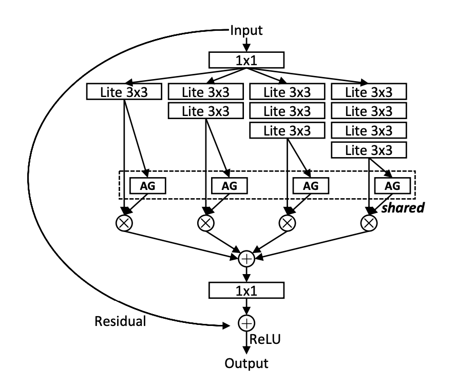
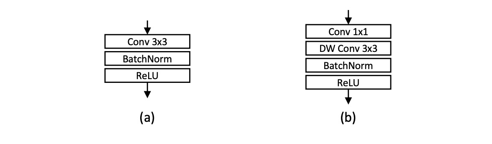
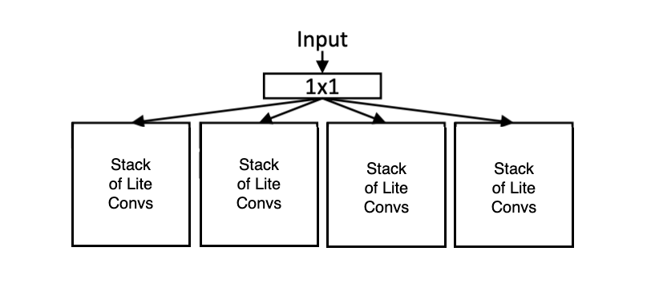
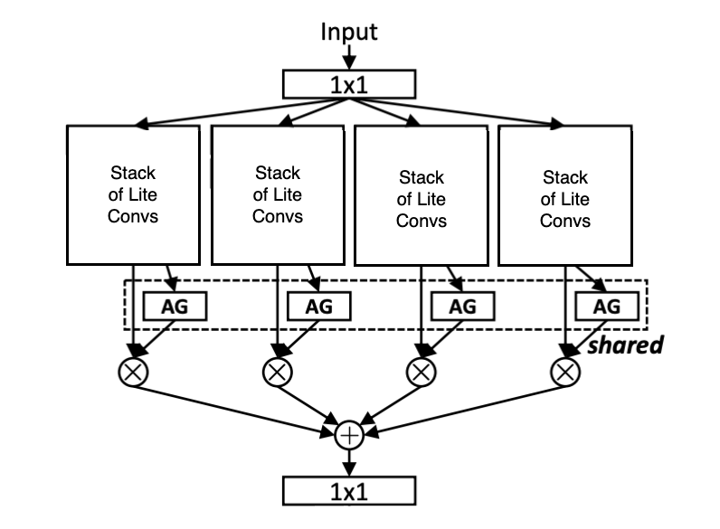
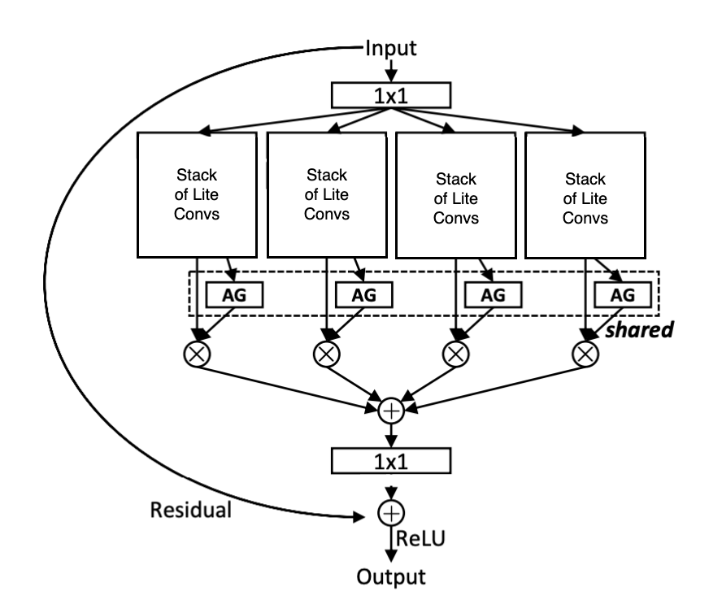
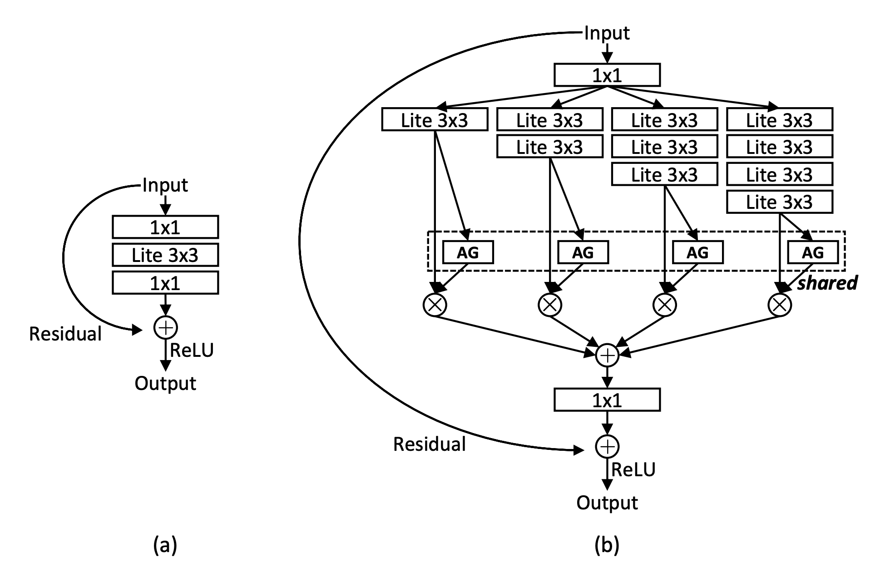
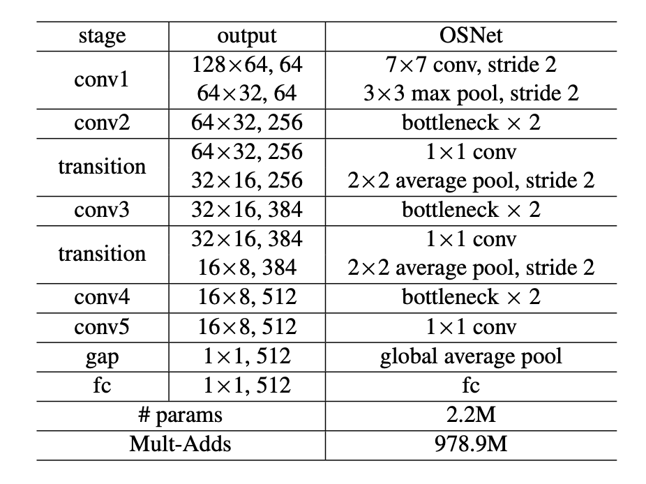
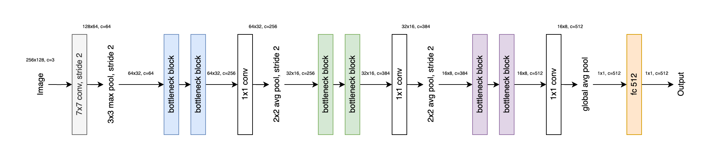
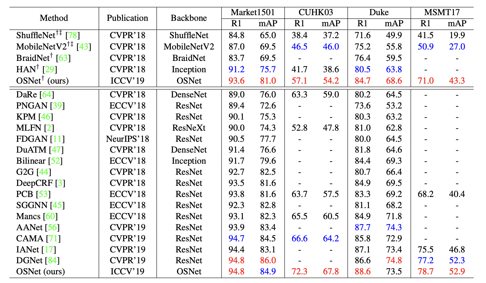

Have you heard of the person re-identification (Re-ID) problem? It consists of identifying the **same person** in different images — but this is a deceptively hard problem: people look really similar in the eyes of the machine (specially from afar!)

And here's the thing, in Re-ID we are not just matching people — we are matching appearances **under wildly different conditions:** different poses, lighting, angles, occlusion, camera resolutions... the list goes on. This leads to two major challenges:

- **Intra-class variance:** The same person can look very different from one camera to another.

- **Inter-class similarity:** Different people can wear the same clothes, especially in uniforms or crowded scenes.

## The Limitation of Existing Methods

A lot of existing Re-ID models rely on heavy backbones like ResNet-50. They're powerful, yes — but often over-parameterized and **not ideal for real-world deployment** (like on edge devices or surveillance systems, where power and memory are often quite limited).

The worst thing is that **many of them are designed to capture information at fixed scales.**

But think about it — **person recognition is multi-scale by nature:**

- Small local details like shoes, logos, and accessories

- Mid-level cues like shirt color or jacket texture

- Global features like body shape or clothing combinations

Relying on a single receptive field just doesn't cut it bbecause different identity cues exist at different scales — a shirt is global, its brand logo is local.

## Omni-Scale Feature Learning

OSNet's (short for Omni-Scale Network), was introduced by <a  target="_blank" rel="noopener noreferrer" href="https://arxiv.org/abs/1905.00953"> Zhou et al., 2019</a>. Its core idea is simple and smart 🧠:

- Learn features at all spatial scales — **simultaneously** — and adaptively combine them.

They call this **Omni-Scale Feature Learning**, and it's the foundation of OSNet's design. Instead of stacking up multiple scales in separate branches (like image pyramids), OSNet bakes scale diversity directly into each block, making the model both efficient and powerful:

<small>Figure 1: OSNet special block architecture</small>

> Don't worry, I know this image might be intimidating , but we'll get to it later.

---

### Key Idea Behind OSNet

When trying to re-identify people across cameras/images, **scale matters a lot**. You might need to recognize someone by their shoes in one view and by their overall outfit silhouette in another (because shoes might not be visible). That means **the model needs to understand both fine-grained and global features** — sometimes all at once.

But here's the thing: 

It's not just about capturing multi-scale features — **it's about knowing which scale matters for which person in which context.**

### OSNet's Core Innovation

OSNet changes the game by introducing the idea of **omni-scale feature learning:** the ability to learn features at multiple spatial scales simultaneously, and adaptively decide which ones to focus on — **all inside a single residual block.**

The core idea builds on depthwise separable convolutions — where, instead of applying a standard convolution, you first perform a depthwise convolution (spatial filtering channel-wise), followed by a pointwise convolution (1 $\times$ 1) to mix the channels and restore dimensionality.

But **OSNet flips the script:**

It applies a **pointwise convolution first, then follows it with a depthwise convolution** (they called this a **Lite Convolution**).

> The subtle difference between the two orders is when the channel width is increased: pointwise $\rightarrow$ depthwise increases the channel width before spatial aggregation.

This reordering — while simple — preserves the lightweight nature of the operation, but improves its flexibility and efficiency for omni-scale feature learning:

<small>Figure 2: (a) Standard 3 x 3 convolution. (b) Lite 3 x 3 convolution. DW: Depth-Wise.</small>

Now that we understand this Lite Convolution, we can dive into the architecture of OSNet special residual block:

1. **Depthwise Separable Convolutions**

To keep the model light and fast, OSNet replaces standard convolutions with depthwise separable convolutions — reducing both computation and parameters without hurting performance.

2. **Multi-stream Blocks**

Each block has several parallel convolutional paths (aka streams), each tuned to a different receptive field (i.e. each with a different number of Lite 3 $\times$ 3 convolutions). This means every block learns from multiple spatial resolutions.

<small>Figure 3: Multi-stream blocks (T=4 streams)</small>

3. **Unified Aggregation Gate (AG)**

Instead of blindly merging all streams, OSNet uses a learnable gating mechanism to dynamically weigh the importance of each scale for each input — making the feature fusion input-aware.

<small>Figure 4: Unified Aggregation Gate to combine output of the different convolution stacks</small>

4. **Residual Connection**

Like in standard ResNets, OSNet includes a residual (skip) connection that bypasses the entire omni-scale block. This helps gradients flow more easily during training, improves convergence, and encourages the model to learn refinements rather than full transformations.

<small>Figure 5: Residual connection added to the mix</small>

Together, these ingredients make OSNet:

- Smarter about scale

- More compact than traditional backbones

- And surprisingly strong for real-world Re-ID tasks

In traditional multi-stream designs, different spatial resolutions are typically achieved by using different convolution kernel sizes — like 3 $\times$ 3, 5 $\times$ 5, or 7 $\times$ 7 — to simulate varying receptive fields.

OSNet takes a different approach: It uses the same Lite 3 $\times$ 3 convolution in all streams, but varies the number of stacked residual blocks in each stream **incrementally**. This way, each stream builds a different effective receptive field — not by changing the kernel size, but by changing the depth!

This design turns out to be both lightweight and highly effective at capturing a wide spectrum of feature scales.

The full architecture of the Omni-Scale block is shown below, in (b):

<small>Figure 6:  (a) Baseline bottleneck. (b) Proposed bottleneck. AG: Aggregation Gate. The first/last 1 x 1 layers are used to reduce/restore feature dimension.</small>

> You might've noticed in the diagram above that all the streams use a **shared Aggregation Gate (AG)** — but why share it?
>
> The AG is shared across all feature streams within the same Omni-Scale residual block (see the dashed box in Fig 6. (b)). This design was inspired by the same philosophy as weight sharing in CNNs — and it comes with a few key advantages:
>
> First, it makes the model more scalable. The number of parameters remains independent of the number of streams (T), so adding more streams doesn't bloat the model.
>
> Second, sharing the AG leads to better gradient flow during backpropagation. Since all streams are funneled through the same gate, updates are coordinated — improving learning stability and making the network more efficient to train.

---

## Network Architecture

OSNet's overall architecture is refreshingly simple:

Just **stack the same bottleneck block** — the omni-scale one — across the network.

That's right. No fancy tricks, no custom blocks per stage. OSNet uses the same lightweight omni-scale residual bottleneck throughout all its layers.

Here's the overall design for input size 256 $\times$ 128:

<small>Figure 7:  Architecture of OSNet with input image size 256x128.</small>

Notation might be a little tricky, so here is a more visual representation I made:

<small>Figure 8:  OSNet architecture</small>

> Notice how after each (pair of) bottleneck blocks, the number of channels increases — from 256 $\rightarrow$ 384 $\rightarrow$ 512. This isn't because of the Lite 3 $\times$ 3 convolutions (those are depthwise and don't change the channel count).
>
> Instead, it's the 1 $\times$ 1 pointwise convolutions before and after the streams that handle the dimensional magic — reducing, then expanding the channel depth (see Figure 6 (b)).
>
> That's where the real control over feature width happens. Neat, right?

For comparison, the same network architecture using standard convolutions contains approximately 6.9 million parameters — that's over 3x larger than OSNet's design with Lite 3 $\times$ 3 convolutions, which has just 2.2 million parameters.

> That said, it's also important to consider computational cost. OSNet performs 979 million mult-add operations, whereas the same architecture with standard convolutions requires a whopping 3,384.9 million mult-adds.

### Relation to Inception & ResNeXt

If the idea of multiple streams sounds familiar, you're not wrong. OSNet draws inspiration from multi-branch models like Inception and ResNeXt — but with a few important upgrades:

- OSNet uses progressive receptive fields (3 $\times$ 3 $\rightarrow$ 5 $\times$ 5 $\rightarrow$ 7 $\times$ 7 $\rightarrow$ 9 $\times$ 9) via repeated Lite 3 $\times$ 3 layers, all using the same kernel size. This ensures better scale diversity.

- Inception was handcrafted for low FLOPs, mixing kernel sizes and pooling.

- ResNeXt uses parallel streams — but all at the same scale.

Most importantly:

**OSNet fuses features dynamically**, using its Unified Aggregation Gate — not fixed addition or concatenation like others.

This makes OSNet input-adaptive, more powerful, and still super lightweight.

---

## Experiments and Comparisons

The authors evaluate it on four major person Re-ID benchmarks, comparing it against both heavyweight and lightweight models. Spoiler: **OSNet is small — but mighty.**

OSNet was tested on four popular Re-ID datasets:

- Market1501: 32,668 images, 1,501 identities, 6 cameras

- CUHK03: 13,164 images, 1,467 identities (manual + auto labels)

- DukeMTMC-reID: 36,411 images, 1,404 identities, 8 cameras

- MSMT17: 126,441 images, 4,101 identities, 15 cameras (much more challenging due to size and variability)

### Performance Highlights

<small>Figure 9:  Results (%) on big re-ID datasets. It is clear that OSNet achieves state-of-the-art performance on all datasets, surpassing most published methods by a clear margin. It is noteworthy that OSNet has only 2.2 million parameters, which are far less than the current best-performing ResNet-based methods. -: not available. †: model trained from scratch. ‡: reproduced by the authors. (Best and second best results in red and blue respectively)</small>

**Compared to Lightweight Models:** On Market1501, OSNet outperforms all other lightweight models, including:

- MobileNetV2

- ShuffleNet

While using fewer parameters and less computation.

**Compared to Heavyweight Models:** Even when stacked against ResNet-50 and ResNet-101 backbones, OSNet still achieves comparable or better accuracy — while being 3× smaller and significantly faster.

---

## Wrapping UP

OSNet is a masterclass in modern network design: **Compact. Clean. Clever.**

By rethinking how we learn multi-scale features — and doing it inside a single residual block — OSNet avoids the overengineering of pyramid-heavy architectures and the bloat of traditional backbones. Its **Unified Aggregation Gate** adds just the right touch of dynamism, allowing the network to **adaptively focus on the right scale at the right time.**

And all of this comes wrapped in a **tiny, deployable package** that competes with — and often outperforms — much larger models.

Whether you're working on person Re-ID, edge vision systems, or just love beautiful architectures, OSNet is worth a closer look. Bonus: it's open source and easy to try: <a target="_blank" rel="noopener noreferrer" href="https://github.com/KaiyangZhou/deep-person-reid">check out the author's GitHub</a>.

---

> You made it! 🎉 If you're reading this, congrats — you've made it through omni-scale gates, multi-stream residuals, and dynamic fusions like a champ 💪 Now you don't just know what OSNet is — you get how and why it works. That's not just reading a paper — that's leveling up 💡

— *Lucas Martinez*  

---