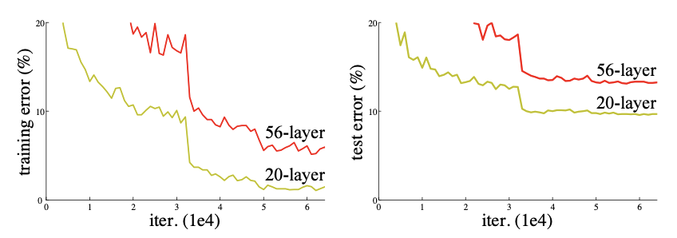
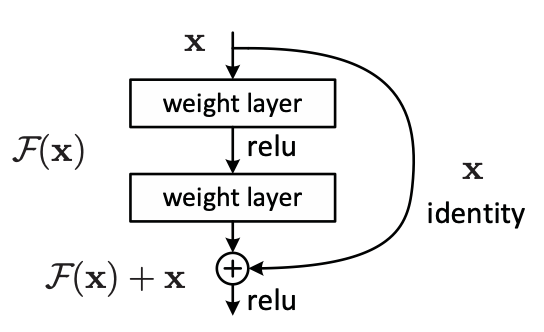
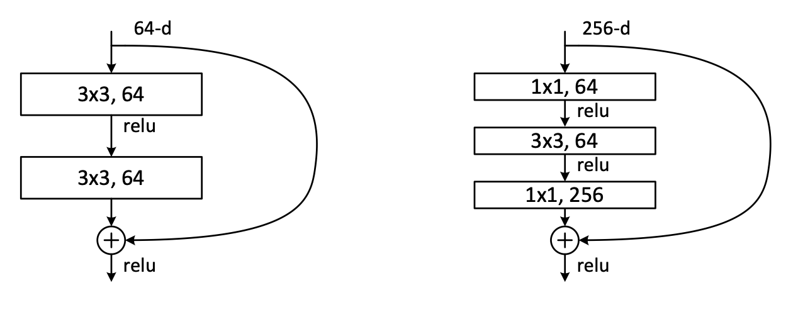
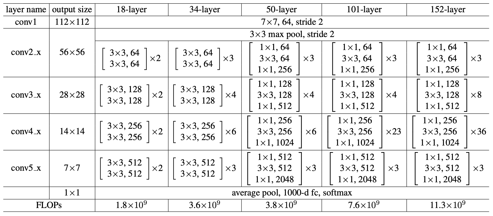
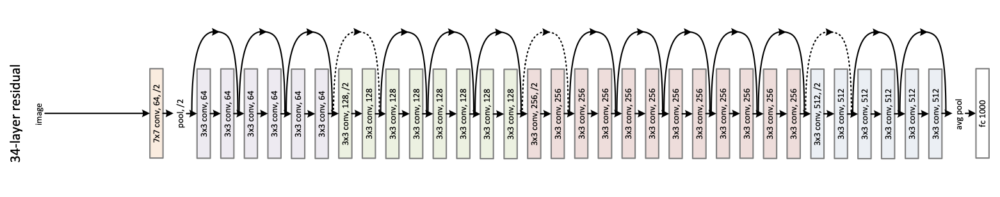

# ResNet: Deep Networks Without the Vanishing Gradient Problem

## Why Was ResNet Proposed?

Remember how **LeCun introduced us to Convolutional Neural Networks (CNNs)**? No? Then I recommend you check out <a target="_blank" href="https://lucas-oma.github.io/post/cnn-convolutional-neural-networks/">my blog about CNN</a> first!

Since then, deep convolutional neural networks have been constantly improving image classification year after year. Every year, a new and deeper CNN would challenge and outperform the previous state-of-the-art CNN. This continued for a couple of years, making models deeper and deeper because, of course, **more layers = better, right?**  

**Well... not quite.**  

As networks got deeper, they started misbehaving in ways that made training a nightmare, leading to what we call the **degradation problem: deeper networks were performing worse than shallower ones!** 

**What was the root of this issue?** Good old **vanishing/exploding gradients**. As layers increased, gradients either became **too tiny to matter (vanishing)** or **blew up uncontrollably (exploding)**, making training unstable.

> **Never heard of vanishing/exploding gradients?** No worries! In simple terms, the learning process requires neural networks to update the weights of each neuron. To do this, we take a  step in the opposite direction of the gradient (**gradient descent**) to find the best solution (minimum error). This process is called **backpropagation**.  
> - If the gradient is too small, the update step is too tiny, meaning the network *barely improves*.  
> - If the gradient is too large, the update step is huge, meaning the network *jumps around chaotically* and never settles in a good spot.  

Want to hear something even weirder? **Deeper networks were not only performing worse on test data but also on training data!** 🤯  (see image below)

<h3>Thus, ResNet enters the main stage.</h3>

This architecture, introduced by **He et al. (2015)** in "<a target="_blank" rel="noopener noreferrer" href="https://arxiv.org/pdf/1512.03385">Deep Residual Learning for Image Recognition</a>", solves these nightmares, allowing us to create **deeper networks without sacrificing performance**.

---

## How Does ResNet Work?

### The Big Idea: Residual Learning

Alright, let’s take a step back. **What were we originally trying to learn in a deep neural network?**

We wanted to learn a function that maps our input $x$ to a desired output. Simple, right? Every layer in a deep network is supposed to **stack transformations** to get closer and closer to the **final solution**.  

Let’s call $H(x)$ to the **underlying mapping function** we want a few stacked layers to learn (not necessarily the entire network).  

ResNet proposed that instead of forcing each stack of layers to directly learn $H(x)$ "from scratch", we make them **learn just the difference** between the input to the stack $x$ and what the stack of layers should have learned originally $H(x)$. This results in:

$$
F(x) := H(x) - x
$$

where $F(x)$ is what we call the **residual function**.  

Thus, instead of learning $H(x)$, ResNet rewrites the problem as:

$$
H(x) = F(x) + x
$$

### Why Is All This Hassle Needed?

Let’s assume we have **two models**, one with **20 layers** and one with **50 layers**, but somehow, the **shallower model performs better**. 🤔  

If the deeper model is smart enough (as it should be), then in theory, it should learn that **every layer after the 20th should simply copy the output forward** (i.e., learn the identity mapping $H(x) = x$. This would ensure the deeper model **performs at least as well as the shallower one.** 

Sounds easy, right? **Well… nope.**  

The problem is that **learning an exact identity mapping is extremely difficult!**  

Just imagine it: we are working with matrices of size $N \times M$ containing floating-point values... and we’re expecting the network to **perfectly** learn an identity function where the output is exactly equal to the input? **Not happening.**

### Residual Learning to the Rescue!

By reformulating the problem as:

$$
H(x) = F(x) + x
$$

we **always keep our previous output** (which is just $x$, the input to the current layer or stack of layers) **in the equation**.  

In this way, **even if the deeper layers learn nothing**, the model will **at least perform as well as the shallower one** because it will still be passing $x$ forward. 

🤯 **Genius, right?** 

Instead of forcing the network to learn something complex like an identity mapping, we let it **learn just the difference** (if there is any), This **fixes the degradation problem** and allows deep networks to **keep improving as they grow.**  

---

## The Residual Block

Now that we know what we actually want a **stack of layers to learn**, let me introduce you to the **Residual Block**: the fundamental building block of ResNet.  

A **Residual Block** is essentially a small **stack of layers** that contains a special ingredient: a **residual connection**, also known as a **skip-connection**.  

> Note: Some people like to call them ResBlocks

And what’s a residual connection? Well, it’s the $+ x$ in our equation $H(x) = F(x) + x$

Once again, this means that if the stack of layers $F(x)$ learns **something useful**, great! 🎉 But if it **fails to learn anything**, no worries, **at least $x$ is still passed forward** without degradation. **No harm done!**  

### The Regular Residual Block

At its core, a **regular Residual Block** looks like this:

This structure allows **gradients to flow easily**, prevents **vanishing gradients**, and ensures that **even very deep networks can learn effectively**.

I often call this regular residual block **"the basic one"**, because it is only **really useful** in shallow networks.  

- Yes, the residual connection also **improves shallow networks**.  
- No, this basic block **isn’t great for deeper networks**. Why? We'll discuss it next. 😉 

### Bottleneck Residual Blocks: A Variation for Deeper Networks  

When scaling ResNet to **really deep networks**, stacking regular Residual Blocks starts to become inefficient.  

Why?  

Because **each convolutional layer is expensive** in terms of **both computations and memory**. And as we go deeper, our **inputs usually have more and more channels**, making things even worse.  

So, how do we fix this? Simple, **reduce the number of channels before applying the expensive convolution, then restore them afterward!!**

And, you’ve guessed it, it’s called a **Bottleneck** because of this reduction in dimension 🤓.
 
Below we can see a residual block to the left, and a **bottleneck residual block** to the ight: 

- The first $1 \times 1$ convolution reduces the number of channels → fewer computations for the $3 \times 3$ convolution.
- The last $1 \times 1$ convolution brings back the original number of channels.
- This makes deeper ResNets much more efficient while maintaining their power.

This **bottleneck structure** makes it possible to **scale ResNet beyond 100 layers without insane computational costs.**  

---

## ResNet and More ResNet  

At this point, we understand why ResNet is such a game-changer. But now, let's talk about the **different versions of ResNet** and how they scale.  

### ResNet Variants and Their Architectures 
These are the different ResNer achitectures introduced in the original paper, take your time to understand it. Below the table, you'll find a drawing for ResNet34 (i.e. 34-layers), this should help you better understand the table.

Noticed the **dotted-line residual connections**? They are there for a reason!  

If you look closely, you'll see that **when moving from one convolutional group to another** (distinguished by kernel size and color in the image), the **dimensions change**. Notice the $/2$ annotation on the first convolution of each group. This indicates that the specific convolution will halve the spatial dimensions (H × W) using a stride of 2.
Additionally, the number of channels also changes, as specified for that convolutional group. Because of this, the **dotted residual connections must first be scaled** to match the expected dimensions.  

**Thinking intuitively:** If we want to **add the input $x$ to the output** (since adding $x$ is the whole point of the residual connection), then $x$ and the output must have the **same dimensions**. However, when switching between groups, $x$ has a different dimension than the new group's output.  

### Scaling $x$ for Residual Connections

When moving between convolutional groups, the **spatial dimensions** and **number of channels** often change due to **stride 2 convolutions** and an increase in the number of filters (kernels). This means the original $x$ (which comes from the previous group) **doesn’t match the new group’s feature map size**.

To fix this, we use a **shortcut projection** via a $1 \times 1$ convolution with **stride 2**, which:
- **Adjusts the number of channels** to match the new block.
- **Downsamples the spatial dimensions** to align with the new feature map size.

This way we ensures that $x$ and the output have the same shape, allowing the residual connection to work.

### What ResNets Considered "Deep" or "Deeper" models?
You probably noticed, from the previous table, that **ResNet-50, 101, and 152** switch from the **Basic Residual Block** to the **Bottleneck Residual Block**.  

Why?  

Because it is well known that once a network reaches **50+ layers**, performing full $3 \times 3$ convolutions on feature maps with a large number of channels **becomes computationally expensive**.  

### Key Takeaways
- **ResNet-18 & 34** use **Basic Residual Blocks**, which are good for shallower networks.  
- **ResNet-50, 101, and 152** use **Bottleneck Residual Blocks**, allowing them to scale **efficiently**.  
- **Deeper ResNets perform better**, but they come at the cost of **more FLOPs** (computations per forward pass).  

---

## Wrapping Up

ResNet was a **turning point** in deep learning. Before its introduction, training **very deep networks** was nearly impossible due to **vanishing gradients and degradation problems**. By introducing **Residual Learning**, ResNet made it possible to train **much deeper networks** without suffering from these issues.  

✅ **Solved vanishing gradients** → Deep networks became trainable. 

✅ **Introduced skip connections** → Enabled gradient flow, stabilizing optimization. 

✅ **Allowed deeper models** → ResNet-50, ResNet-101, and beyond became practical.  

✅ **Still used in modern architectures** → Many recent models build on ResNet’s foundations.

Even after (almost) a decade since its introduction, ResNet's principles remain fundamental in deep learning, powering some of the most widely used architectures for image classification, object detection, and segmentation.

---

> Congratulations! 🎉 You’ve just mastered one of the most influential architectures in deep learning history! 🚀 ResNet didn't just solve the vanishing gradient problem, it redefined how we train deep networks. And guess what? Residual connections didn’t stop with ResNet. Even the almighty Transformer architecture uses them to stabilize training! So next time you see a state-of-the-art model, take a closer look, you might just find ResNet’s fingerprints all over it. 🤖🔥

— *Lucas Martinez*  

---